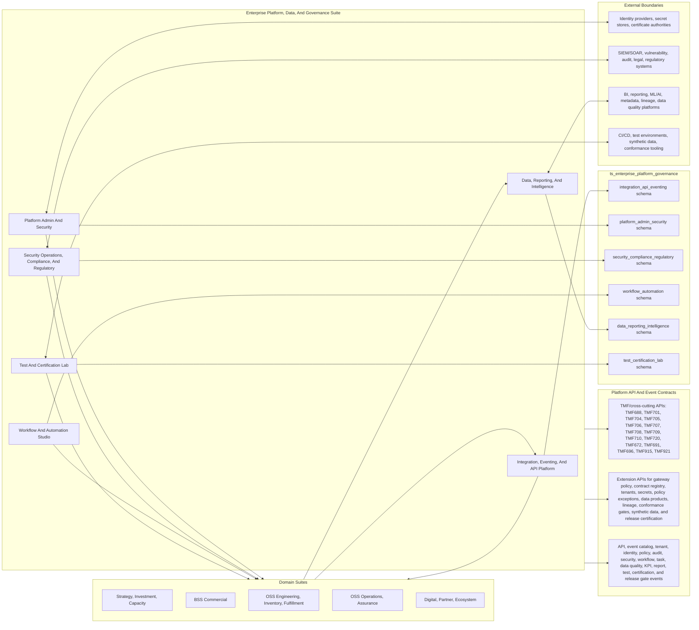
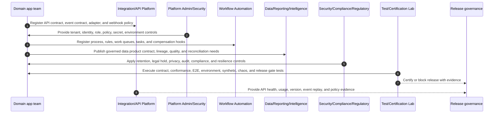
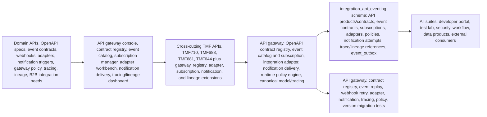
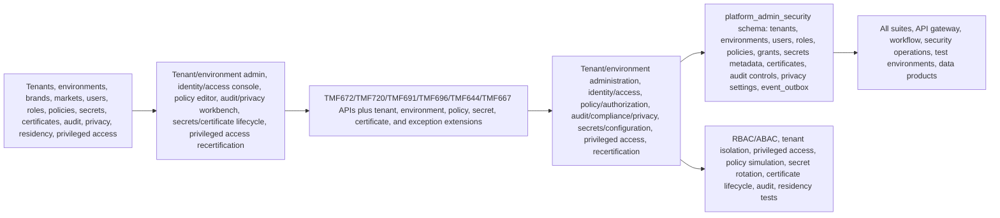
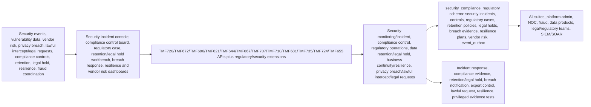
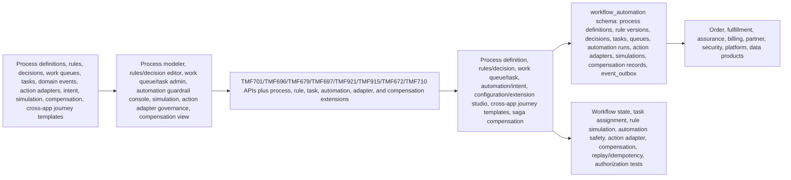
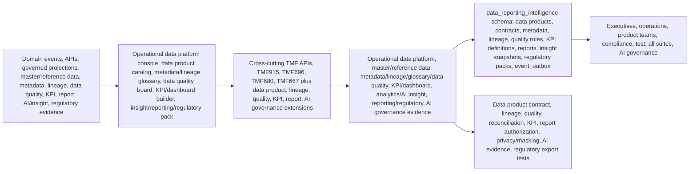
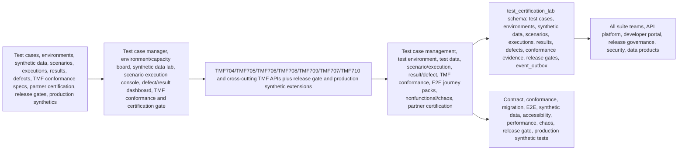

# Enterprise Platform, Data, And Governance Architecture Diagrams

Reviewed: 2026-06-14

## Purpose

Use these diagrams when building the Enterprise Platform, Data, And Governance suite and its apps. They show how platform APIs, eventing, identity, security, workflow, data products, reporting, compliance, test, and certification support all other TelcoSuite suites without becoming hidden operational masters for domain data.

Primary sources:

- [Implementation File Usage Guide](implementation-file-usage-guide.md)
- [Tech And UI Guidance](tech-and-ui-guidance.md)
- [Data Model](data-model.md)
- [Journey Coverage](journey-coverage.md)
- App `implementation-file-usage.md`, `README.md`, `modules-and-features.md`, `personas-and-user-journeys.md`, and `features/` detail packs
- [TMF API To DDL Traceability Matrix](../tmf-api-to-ddl-traceability-matrix.md)
- `database/postgres/suites/ts_enterprise_platform_governance/`

## Suite Architecture

## Suite Build Flow

## App Architecture: Integration, Eventing, And API Platform

## App Architecture: Platform Admin And Security

## App Architecture: Security Operations, Compliance, And Regulatory

## App Architecture: Workflow And Automation Studio

## App Architecture: Data, Reporting, And Intelligence

## App Architecture: Test And Certification Lab

## Build Use

Use these diagrams to keep the platform suite as the governed control plane. Platform apps provide APIs, identity, policy, workflow, security, data products, and tests; they should not directly mutate another suite's operational master data.
